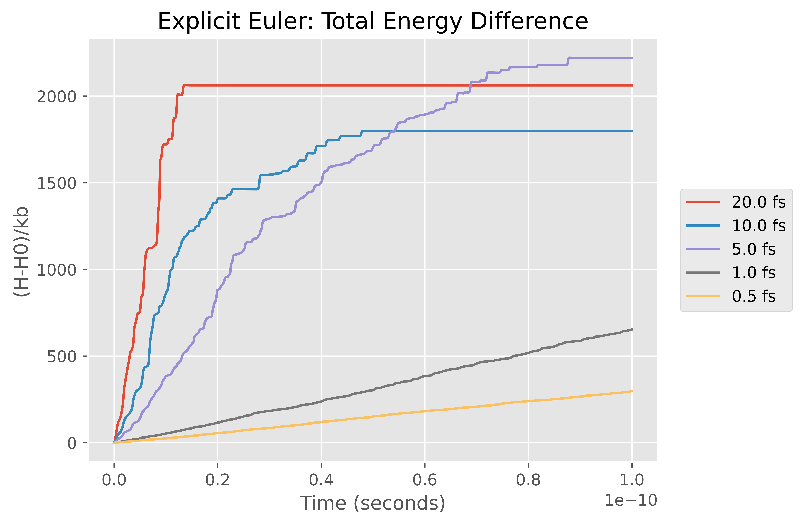
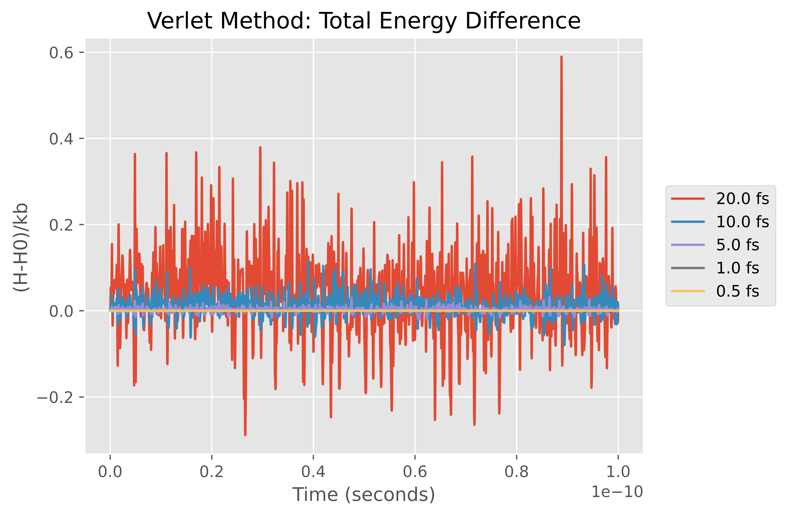
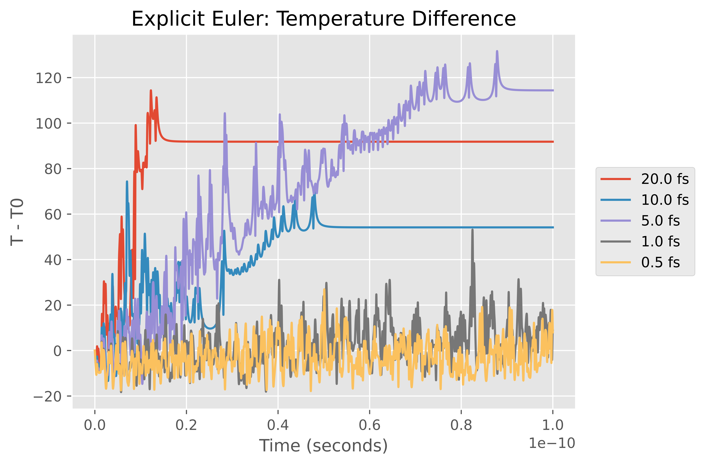
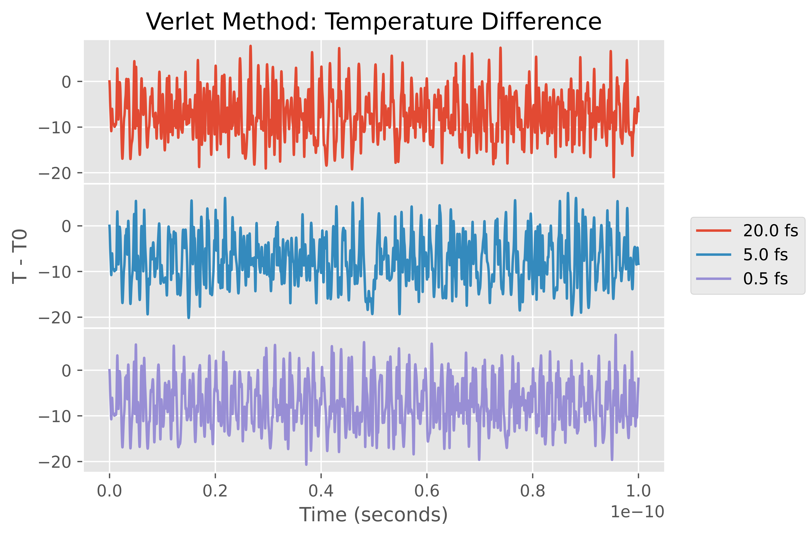

# euler-vs-verlet

This was a comparison of the Explicit Euler and Verlet integration methods to simulate a collection of seven argon atoms that are governed by the following Hamiltonian

%20=%20\frac{1}{2}\sum_{i=1}^{N}\frac{1}{m_i}p_i^Tp_i%20+%20\sum_{i=2}^{N}\sum_{j=1}^{i-1}%20U_{ij}\left(||q_i-q_j||\right))

with the Lennard-Jones potential

%20=%204\epsilon_{ij}%20\left(%20\left(\frac{\sigma_{ij}}{r}\right)^{12}%20-%20\left(\frac{\sigma_{ij}}{r}\right)^{6}%20\right).)

The constants needed are defined in the code with units. The atoms all have a starting position and velocity (specified in the code along with units as well). The aim was to replicate results from section 1 I.4 Molecular Dynamics in the text "Geometric Numerical Integration". 

I ran both methods for a time period of .1 nanoseconds with each method using time-steps of 20, 10, 5, 1 and 0.5 femtoseconds. In a perfect simulation of this system, the total energy would be zero as time progressed. Plotting the results of the simulation for each method, you can see that the Verlet method is much more accurate than the Explicit Euler method. 

<i>|<i>
:-------------------------:|:-------------------------:
|

You can do something similar for the temperature of the system. Instead of hovering around zero, the temperature should stay around some constant value. Here are those plots

<i>|<i>
:-------------------------:|:-------------------------:
|

Again you can see Verlet method hovers around a constant value while the Explicit Euler method deviates as time progresses. One nice thing to see is the simulated motion of the atoms themselves for each method. They should be pretty much stationary and for the lower time-steps this appears to be the case. However the difference between the two methods is clear for the 20 fs time-step. Here are animations of that

<i>|<i>
:-------------------------:|:-------------------------:
|

It's very clear here that for this higher time-step, the Verlet method is better able to simulate how these atoms should stay near their original positions while the atoms end up scattering in the Explicit Euler simulation.

